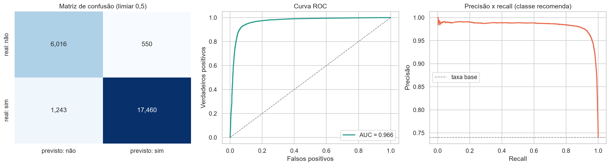
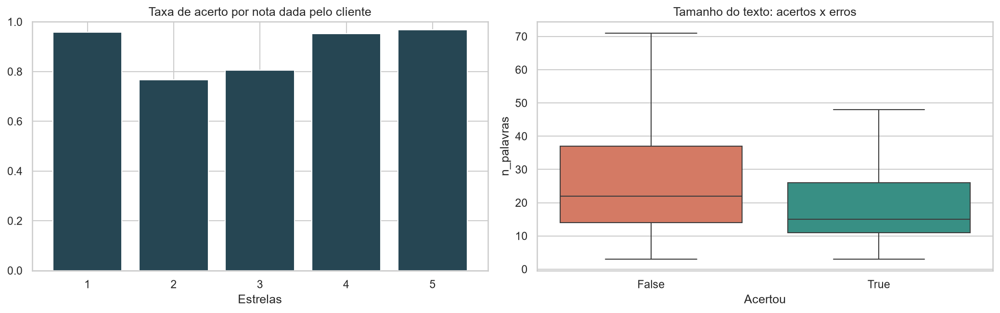
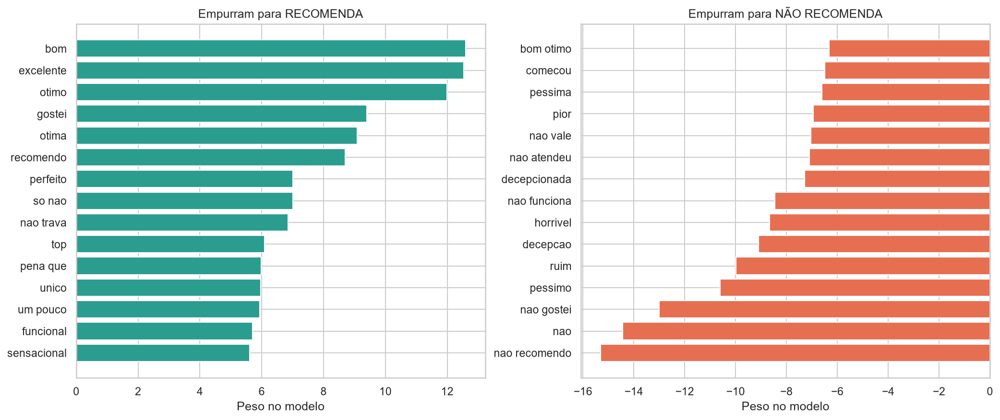

# 🛒 Prevendo insatisfação de clientes a partir do texto da avaliação

Classificação de texto em português: a partir do que o cliente escreveu sobre um produto, prever se
ele **recomendaria a compra a um amigo**. O objetivo prático é detectar clientes insatisfeitos sem
depender da nota em estrelas — útil para priorizar atendimento e monitorar produtos problemáticos.

**Base:** [B2W-Reviews01](https://github.com/americanas-tech/b2w-reviews01) — mais de 130 mil avaliações
de clientes da Americanas.com entre janeiro e maio de 2018, com texto, nota de 1 a 5, resposta
"recomendaria a um amigo", categoria do produto e perfil do avaliador. Licença CC BY-NC-SA 4.0.

## Principais resultados

**ROC AUC de 0,966 e acurácia de 92,9%** em 25.269 avaliações de teste, com um pipeline de TF-IDF e
regressão logística. Para a classe minoritária (quem não recomenda, 26% da base), o F1 foi 0,870,
com recall de 91,6%.

| Modelo | ROC AUC (validação cruzada) |
|---|---|
| **Regressão logística** | **0,966** |
| Linear SVC | 0,965 |
| Complement Naive Bayes | 0,958 |
| Baseline (classe majoritária) | 0,500 |

**O modelo erra onde os próprios clientes se dividem.** A taxa de acerto passa de 95% nas avaliações
de 1, 4 e 5 estrelas, mas cai para 77% nas de 2 estrelas e 81% nas de 3. São os casos em que o cliente
gostou do produto e reclamou da entrega, ou o contrário — contradições reais entre nota e recomendação
que existem na própria base e estabelecem um teto de acerto.

**Ajustar o limiar de decisão rendeu pouco.** O melhor F1 da classe minoritária aparece em 0,35
(0,876 contra 0,870 no limiar padrão), o que indica um modelo já bem calibrado. A análise fica no
notebook porque a escolha do corte depende do objetivo: para varrer o máximo de insatisfeitos,
vale sacrificar precisão em troca de recall.

**Os pesos do modelo são auditáveis**, uma vantagem prática dos modelos lineares sobre texto: dá para
mostrar exatamente quais palavras empurram cada previsão.

## Metodologia

**Alvo.** Foi escolhido `recommend_to_a_friend` (binário) em vez da nota em estrelas: tem leitura de
negócio direta e evita tratar a distância entre estrelas como se fosse uniforme.

**Preparação.** Título e texto concatenados, normalização (minúsculas, remoção de pontuação e URLs) e
exclusão de avaliações sem texto ou com menos de três palavras. **Textos duplicados foram removidos**:
se o mesmo comentário cair no treino e no teste, a métrica fica otimista.

**Representação.** TF-IDF com unigramas e bigramas, para capturar expressões como "não recomendo" e
"chegou quebrado", descartando termos presentes em menos de cinco avaliações.

**Validação.** Divisão estratificada 80/20, seleção de modelo por validação cruzada de 5 folds sobre o
treino, e o conjunto de teste usado apenas na avaliação final. Como as classes são desbalanceadas,
a comparação usa ROC AUC e as métricas da classe minoritária, não acurácia.

## Limitações

- A base é de 2018 e de um único varejista: o vocabulário pode não se transferir para outro contexto.
- Textos muito curtos dão pouca informação, e são justamente os mais frequentes.
- O modelo captura padrões de escrita, não a experiência real do cliente.
- Contradições legítimas entre nota e recomendação limitam o acerto máximo possível.

**Evolução natural:** comparar este baseline com embeddings do BERTimbau (BERT em português).
O ganho tende a ser modesto em texto curto, com custo computacional bem maior — e medir essa
diferença é parte do trabalho.

## Estrutura

| Notebook | Conteúdo |
|---|---|
| `01_eda_texto.ipynb` | Distribuição dos rótulos, vocabulário por classe, categorias e qualidade dos dados |
| `02_classificacao.ipynb` | Comparação de modelos, escolha do limiar, análise de erros e interpretação dos pesos |

## Como reproduzir

1. Baixe o `B2W-Reviews01.csv` em https://github.com/americanas-tech/b2w-reviews01 e coloque
   em `data/raw/` (o arquivo é separado por vírgula e está em UTF-8)
2. Prepare o ambiente:

       python -m venv .venv
       .venv\Scripts\activate
       pip install -r requirements.txt

3. Execute os notebooks da pasta `notebooks/` em ordem.

## Stack

Python · pandas · scikit-learn · matplotlib · seaborn

---
**Cristian Guedes** · [LinkedIn](SEU-LINK-AQUI)
